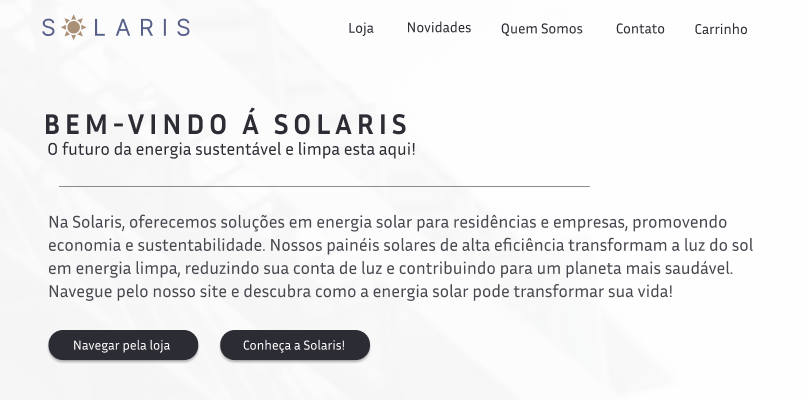

# ☀️ Solaris Panel Store

**Solaris Panel Store** é um projeto de e-commerce moderno e minimalista focado na venda de painéis solares. O design e a interface são cuidadosamente planejados para oferecer uma navegação simples, eficiente e agradável, com foco na sustentabilidade e inovação.

## 🎨 Design e Estilo

O site adota um design moderno, minimalista e intuitivo. As escolhas de cores e o layout são voltados para proporcionar uma experiência fluida e centrada no usuário. 

- **Cinza (vários tons):** Usado como base neutra para manter um visual clean e moderno.
- **Azul Escuro e Azul Claro:** Refletem a tecnologia e sustentabilidade, lembrando a cor dos painéis solares.
- **Amarelo Suave:** Representa o sol, complementando a temática de energia solar de forma sutil.

O foco principal é criar uma interface atraente, fácil de navegar e com ênfase nos principais produtos e informações.

## 🌟 Objetivo do Design

O design visa captar a atenção do cliente por meio da simplicidade e praticidade, sem sobrecarregar com informações. Cada elemento foi projetado para melhorar a jornada do usuário, mantendo uma experiência visual limpa e organizada.

## 🖥️ Páginas do Site

### 1. **Página Inicial**
   - **Carrossel de Novidades:** Apresenta os lançamentos mais recentes.
   - **Produtos Mais Visitados:** Destaque para os produtos mais populares.
   - **Inscrição para Ofertas:** Campo para cadastro de e-mail e recebimento de promoções.

### 2. **Loja de Produtos**
   - **Filtros Interativos:** Por categoria, marca e preço.
   - **Pesquisa Avançada:** Para encontrar produtos específicos.
   - **Lista de Desejos e Carrinho:** Opções para salvar produtos e adicioná-los ao carrinho.

### 3. **Detalhes do Produto**
   - **Imagens em Alta Resolução:** Visualização detalhada dos produtos.
   - **Cálculo de Frete:** Baseado no CEP inserido.
   - **Abas Informativas:** Especificações, avaliações e documentação do produto.

### 4. **Carrinho**
   - **Modificação de Quantidades e Aplicação de Cupons:** Interações dinâmicas para ajustes no pedido.
   - **Cálculo de Frete Automático:** Simplifica o processo de compra.
   - **Acesso Fácil ao Checkout:** Design otimizado para uma compra rápida.

### 5. **Contato**
   - **Formulário Completo:** Inclui campos obrigatórios e opções de seleção de assunto para facilitar a comunicação.

### 6. **Outras Páginas**
   - **Novidades:** Atualizações e tendências no setor de energia solar.
   - **História:** Trajetória da empresa.
   - **Missão:** Valores e objetivos da organização.
   - **Equipe:** Detalhes sobre os colaboradores.
   - **Quem Somos:** Visão geral e princípios da empresa.

## 🔄 Fluxo para guiar o desenvolvedor

Esse sistema de sinalização visual otimiza o entendimento e agiliza o trabalho de desenvolvimento, permitindo que a funcionalidade de cada botão e seu destino sejam facilmente identificado:

- **Setas Cinzas:** Conectam os botões com as descrições de suas respectivas funções, explicando o que cada botão faz.
- **Setas Azul Claro:** São usadas para indicar de maneira direta o destino da ação daquele botão, facilitando a navegação e a compreensão do fluxo.

## 🚀 Objetivo Geral

Criar uma interface visualmente atraente, intuitiva e funcional que facilite a compra de painéis solares de forma eficiente. O site foi projetado para oferecer uma comunicação clara e ferramentas interativas, proporcionando uma experiência otimizada para o cliente.

## 🛠️ Tecnologias Utilizadas

- **Figma** (para o design e prototipagem)

